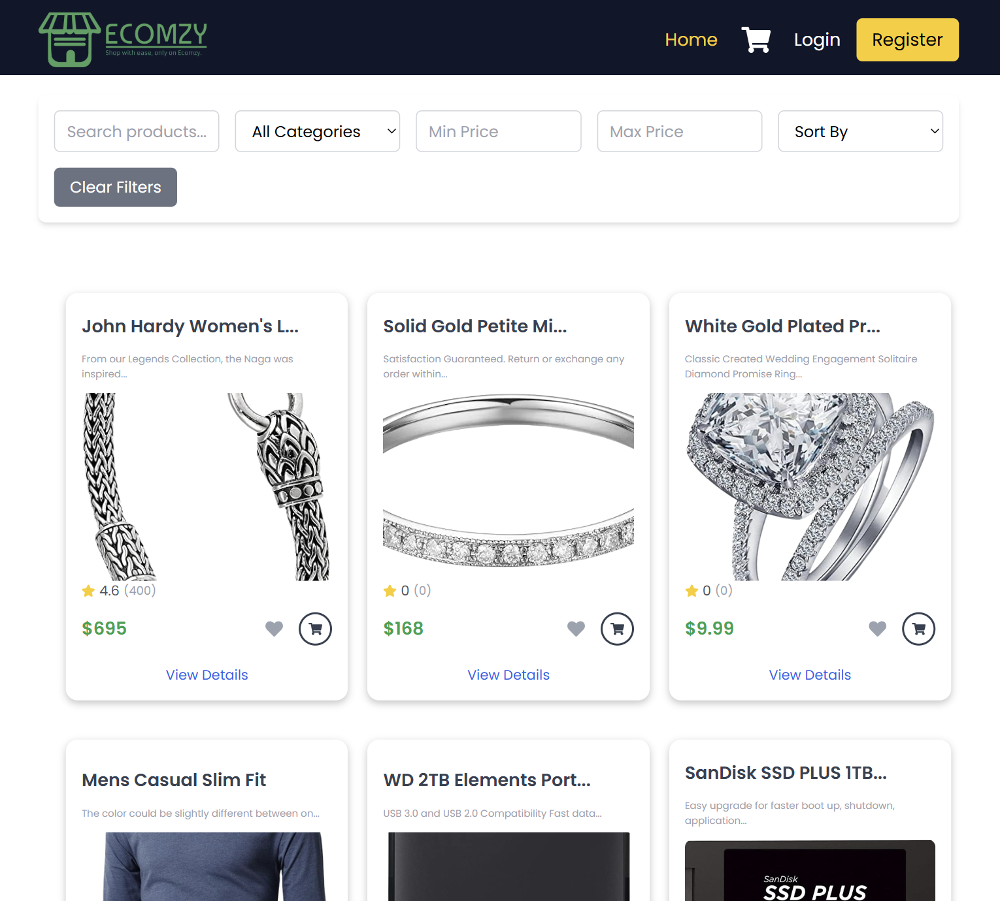
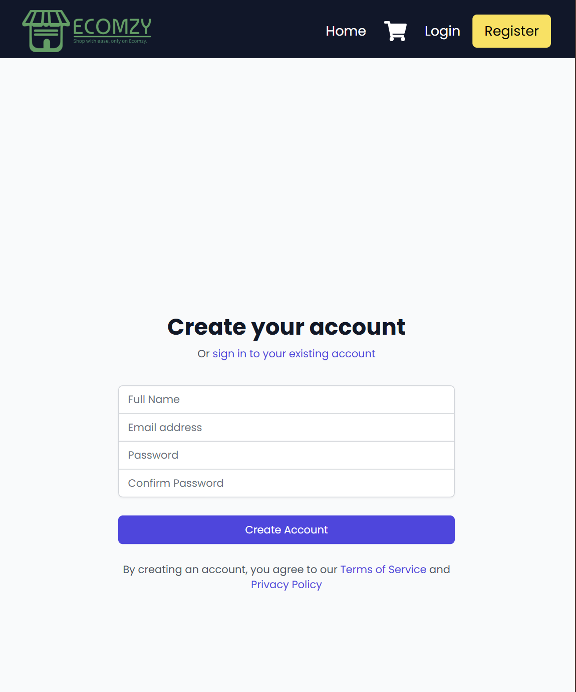

# 🛒 ECOMZY — An Online E-Commerce Platform (MERN Stack App)   [Live Demo](https://ecomzy-topaz.vercel.app)






> **Ecomzy** is a modern full-stack **e-commerce platform** where users can browse products, manage carts and wishlists, place orders, and make secure payments. Admins can manage products, orders, and users with an intuitive dashboard.  


---

## 🔎 Project Summary  

Ecomzy is a feature-rich platform designed for both customers and admins:  

- Customers can browse products, add to cart, checkout, and pay securely.  
- Wishlists allow users to save products for later.  
- Orders can be tracked, with payment integration through **Stripe**.  
- Admins can manage products, users, and orders with analytics.  
- Built with **React (frontend)**, **Node/Express (backend)**, **MongoDB (database)**.  

In the following sections, we cover the technical details including:  

1. **System Architecture**: high-level overview + diagram.  
2. **Front-End**: features, UI design, tools, libraries.  
3. **Back-End**: APIs, logic, frameworks, database schema.  
4. **API Design**: endpoints and sample requests.  
5. **Deployment**: hosting setup, env configs.  
6. **Testing**: frameworks and approach.  
7. **Future Enhancements**.  

---

## 🏗️ System Architecture  

The e-commerce platform follows a **client–server model**:  

- **Frontend (React)**: customer-facing UI and admin dashboard.  
- **Backend (Node + Express)**: REST APIs for products, orders, users, payments.  
- **Database (MongoDB)**: stores products, orders, and user data.  

### Architecture Diagram  

> Add a diagram like `images/architecture.png`  

  

---

## 🎨 Front-End  

The **frontend** is built using **React + Redux Toolkit** for state management.  

### Customer Features:  
- Homepage with featured products.  
- Product listing + filtering + search.  
- Product details page with reviews.  
- Cart & wishlist management.  
- Checkout flow with Stripe integration.  
- Order history page.  
- User profile & account editing.  

### Admin Features:  
- Dashboard: sales, orders, revenue overview.  
- Product Management: add, update, delete products.  
- User Management: view and manage customer accounts.  
- Order Management: view orders, update status.  

**Tech Used:** React, Redux Toolkit, React Router, TailwindCSS, Axios, Toastify.  

---

## ⚙️ Back-End  

The **backend** is built with **Node.js & Express.js**, following a modular monolithic structure.  

### Features:  
1. **Authentication & Authorization**: JWT-based login/register, roles (user/admin).  
2. **Product Management**: CRUD for products with categories and reviews.  
3. **Cart & Wishlist**: linked to users.  
4. **Order Management**: order lifecycle from creation → payment → delivery.  
5. **Payment Integration**: Stripe for secure payments.  
6. **Cloud Storage**: Cloudinary for product images.  

### Tech Used:  
- **Node.js** – runtime.  
- **Express.js** – web framework.  
- **MongoDB + Mongoose** – database + ODM.  
- **JWT + bcrypt** – security.  
- **Stripe** – payments.  

### Database Schema:  
- **User Schema**: name, email, password (hashed), role, cart, wishlist.  
- **Product Schema**: name, description, price, stock, category, image, reviews.  
- **Order Schema**: user, products, total price, payment info, status.  


---

## 🔌 API Design  

The backend provides a **RESTful API**.  

### Auth  
- `POST /api/auth/register` → Create account  
- `POST /api/auth/login` → Authenticate user  

### Products  
- `GET /api/products` → List products  
- `POST /api/products` → Create product (admin)  
- `GET /api/products/:id` → Product details  

### Cart & Wishlist  
- `POST /api/cart` → Add to cart  
- `GET /api/cart` → Fetch cart items  
- `POST /api/wishlist` → Add to wishlist  

### Orders  
- `POST /api/orders` → Place order  
- `GET /api/orders/myorders` → User’s orders  
- `PUT /api/orders/:id/status` → Update order status (admin)  

### Payments  
- `POST /api/payments/create-intent` → Start Stripe payment  

---

## 🚀 Deployment  

### Backend:  
- Hosted on Render / AWS / Heroku.  
- MongoDB Atlas as managed DB.  

### Frontend:  
- Hosted on Netlify / Vercel.  

### Env Variables:  

**Backend `.env`:**  
```env
PORT=5000
MONGO_URI=mongodb://localhost:27017/ecommerce_db
JWT_SECRET=your_secret
STRIPE_SECRET_KEY=sk_test_xxx
FRONTEND_URL=http://localhost:3000
